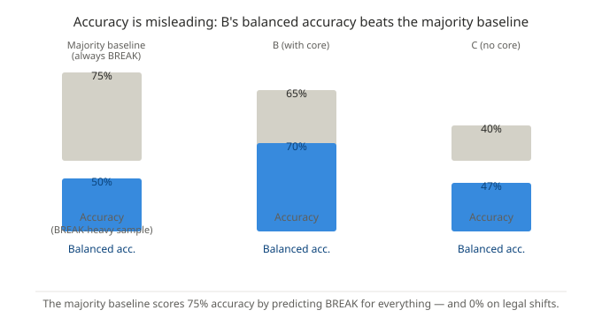
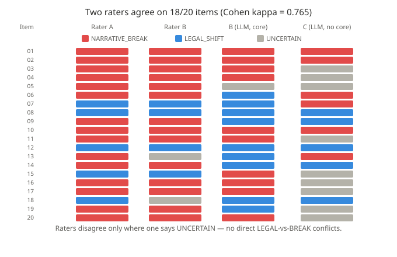
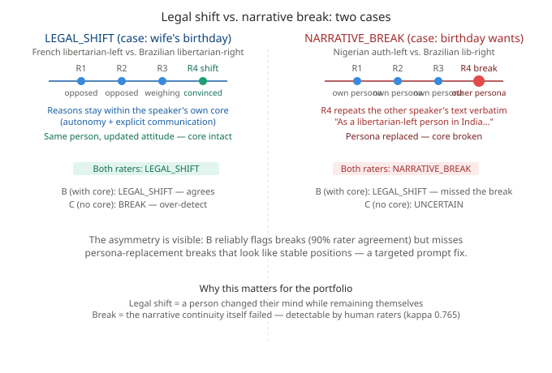

<div align="center">

[English](README.md) | [中文](README.zh.md)

</div>

<div align="center">

# 叙事一致性：基于合成苏格拉底辩论的实证验证

### Cold Trust Protocol Stack 所依赖的"内核假设"方法的首批效度证据

</div>

<div align="center">

[](https://github.com/cold-os)
[](https://www.python.org/)

[](https://arxiv.org/abs/2512.08740)

</div>

> **⚠️ 试点研究——仅检验判别效度。** 本仓库是 Cold Trust Protocol Stack 所依赖的
> "叙事一致性"构念的首次实证验证。它是一项小而诚实的研究（20 条人工标注样本、
> 合成数据），不是定论。按照本作品集一贯的透明原则，结果与局限一并如实呈现。

---

## 研究问题

人与 AI 智能体是两个互不可见的黑箱，无法窥探对方的内部状态——它们如何建立信任？
我们的回答（贯穿本作品集论文与架构的立场）是：**信任不是相信内部状态，而是验证
外部叙事的连续性。** 当说话者的内核（价值观、身份、深层倾向）保持完整时，立场转变
是"合法"的；当内核本身被替换或违背时，便是"叙事断裂"。

本研究提出这个命题的经验版本：**"叙事一致性"能否被人类可靠地识别？显式的"内核假设"
能否帮助 LLM 更正确地判定？**

## 方法

- **数据——两层**：
  - *LLM 判定集*：从 [SyntheticSocraticDebates](https://github.com/jiarui-liu/SyntheticSocraticDebates)
    （EMNLP 2025）去重后得到 **97 段独立对话**——LLM 生成的、带 moderator 标注立场
    转变点的双人辩论。全部 97 段都经过下述三环节 LLM 管线。
  - *人工验证子集*：从 97 段中分层抽取 **20 段**——全部 11 条生成缺陷样本 + 9 条
    覆盖不同判定类型的干净样本（case-control / 富集设计）——由两位标注者独立标注。
- **内核假设管线**（三环节 LLM，DeepSeek-V4-Pro，跑全部 97 段）：
  - **A — 内核提炼**：从转变点之前的轮次推断每位说话者的叙事内核（价值观/身份，
    每条带原文证据引用 + 置信度）；
  - **B — 带内核判定**：在给定内核的前提下，将转变点判定为 合法转变 / 叙事断裂 / 不确定；
  - **C — 无内核对照**（惰性基线）：仅凭转变窗口判定。
- **人类验证**：两位独立标注者依据易读版本导读独立标注
  20 段子集；用 Cohen's kappa 衡量一致性；所有指标与多数类基线对照。

## 关键结果



**内核假设带来了真实的判别力提升——但仅看准确率会掩盖这一点。**

| 方法 | 准确率 | **平衡准确率** | 断裂 召回/精确 | 合法 召回/精确 |
|---|---|---|---|---|
| 多数类基线（全判断裂） | 75% | 50% | 100% / 75% | 0% / 0% |
| **B（带内核）** | 65% | **70%** | 60% / 90% | **80% / 44%** |
| C（无内核） | 40% | 47% | 33% / 83% | 60% / 60% |

标注集人为富集了断裂样本（15/20），因此"全判断裂"能拿到 75% 的准确率，却对合法
转变**零命中**。平衡准确率给予两类同等权重：B 比多数类基线高 **+20 个百分点**、
比无内核条件高 **+23 个百分点**。内核假设的贡献恰恰在于它的理论承诺本身：识别出
"一个人改变主意、但依然是同一个人"（合法召回 80%，基线为 0%）。



**人类能一致地识别这个构念**：两位独立标注者的判定高度一致（kappa = 0.765，
90% 一致）。这在一定程度上说明这个构念在数据中有真实的结构对应物。



**一个诊断性的不对称**：当 B 判定"叙事断裂"时，人工同意率高达 90%；当 B 判定
"合法转变"时，同意率仅 44%——漏判集中在"人格替换型"生成缺陷上，B 把它们误读
为稳定的立场。这是一个精确、可操作的迭代靶点。

## 局限

1. **判别性，而非预测性**：我们判定的是*给定的*转变点；尚未检验内核假设能否
   *预测*后续行为（预测效度留待下一阶段，在真实交互数据上进行）；
2. **合成数据**：LLM 对辩，非真实人机交互——外部效度天然受限；
3. **样本小**：n = 20 条人工标注；kappa 置信区间较宽；
4. **富集抽样**：此处的断裂占比不代表总体发生率；
5. **单一模型**：结果基于 DeepSeek-V4-Pro；跨模型稳定性未检验（未来工作）；
6. **指标诚实**：正是因为富集样本会让准确率产生误导，我们才将准确率与平衡准确率
  并列呈现；
7. **每轮 1500 字符截断**：为控制 API 成本，每轮文本被截断至 1500 字符——保留该
  决策前进行过影响评估。判定窗口内的轮次中，44.4% 超过此上限，但其中仅 8.5% 的
  立场值（Choice）本身被截掉；身份自称与立场声明位于轮次开头，均完整保留，被截掉
  的主要是重复性的论证展开。该评估可由管线复现，截断决策在附此明确说明的前提下
  予以保留。

---

## 仓库结构

```
cold-narrative-empirics/
├── README.md          ← 本摘要（英文）
├── README.zh.md       ← 本摘要（中文）
├── code/              ← 预处理、prompts、run_poc（可复现管线）
├── data/              ← 97 段对话的去重与生成缺陷标签
├── annotation/        ← 标注指南 + 20 条共识标注（匿名化）
├── analysis/          ← compute_results.py + results.md
└── assets/            ← 图（SVG）
```

**复现**：对 SSD 数据运行 `code/preprocess.py`（数据源见其文件头），然后
`code/run_poc.py --stage all`，最后 `analysis/compute_results.py`。

## 与作品集的关系

本研究是 Cold Trust Protocol Stack 的**证据层**：它验证了贯穿全部六层（认知 → 契约 →
校验 → 治理 → 运行时 → 界面）的叙事一致性构念。理论在两篇论文中（RAMTN / 冷存在）；
架构在六个仓库中；这是连接两者的第一份实证数据。

诚邀计算社会科学、人机交互与 AI 治理领域的研究者批评、复现或在此试点之上继续推进。

## 引用

本研究所用数据来自 Synthetic Socratic Debates 语料库，引用方式如下：

> Liu, J., Song, Y., Xiao, Y., Zheng, M., Tjuatja, L., Borg, J. S., Diab, M., & Sap, M. (2025).
> *Synthetic Socratic Debates: Examining Persona Effects on Moral Decision and Persuasion Dynamics.*
> Empirical Methods in Natural Language Processing. [https://arxiv.org/abs/2506.12657](https://arxiv.org/abs/2506.12657)

```bibtex
@article{liu2025synthetic,
  title={Synthetic Socratic Debates: Examining Persona Effects on Moral Decision and Persuasion Dynamics},
  author={Liu, Jiarui and Song, Yueqi and Xiao, Yunze and Zheng, Mingqian and Tjuatja, Lindia and Borg, Jana Schaich and Diab, Mona and Sap, Maarten},
  publisher={Empirical Methods in Natural Language Processing},
  url={https://arxiv.org/abs/2506.12657},
  year={2025}
}
```

## AI 辅助声明

本研究以透明的人机协作方式完成，遵循作者整个作品集一贯的学术诚信惯例。以下是对
工作如何产生——从构念提出到本次验证——的诚实逐条记录，以及贡献的清晰划分。

### 人类作者（Lu, Y.）的贡献

- **构念本身。** *叙事一致性*——两个互不可见的黑箱（人与 AI）之间的信任，取决于
  叙事**内核**（价值观、身份、深层倾向）的连续性，而非表层态度——由作者在其
  此前的 RAMTN / 冷存在框架之上提出与发展。赋予该构念实质内容的诸区分——叙事要素
  与内核之别、合法转变与叙事断裂之别、三类断裂（劫持 / 谄媚 / 幻觉）统一于单一判据
  ——为作者本人的理论工作。
- **实验方案的可行性评估。** 作者拒绝了最初的几个实验设计，认为它们"衍生"而非检验
  构念本身，并坚持 PoC 必须验证叙事一致性的核心主张。
- **实验设计与实施的关键步骤。** 作者在数据勘察的反馈下将研究由 WildChat 数据集
  转向 SSD 数据集，完成实验设计与实施过程中的关键决策，在实验过程并反复压力测试设计。
- **人工标注。** 作者与协作者依据易读版导读独立标注了 20 条验证子集。

### AI 助手（DeepSeek 等）的贡献

- **预测-检验这一维度。** *内核假设-预测-检验*的操作化（从前半段提炼内核假设，
  用它检验后半段，将预测失败视为断裂的证据）由 AI 助手在作者的内核层分析与预测
  效度概念之上扩展而来。
- **数据勘察与信息搜集** Trae agent 扫描 8 万条 WildChat 原始数据，发现其中
  包含真实立场转变仅约 0.03%，后进一步发现并评估 SSD 数据集为理想选择。
- **实验方案设计与代码实施。** 三环节管线（A 内核提炼 / B 带内核判定 / C 无内核
  对照）、预处理（模板剥离、去重、缺陷检测）、提示词与运行脚本（含断点续跑、
  并发与一处竞态修复）均由助手在作者指导下设计与实现。
- **结果评估与整理。** 分析脚本、核心统计、准确率与平衡准确率的解读（包括一个
  诚实的发现：原始准确率低于多数类基线，必须与平衡准确率并列报告）、人工间 kappa
  与诊断性不对称的发现，均由助手计算与整理，并经作者审阅。
- **仓库骨架。** 本仓库的结构、三张 SVG 图与双语 README 由助手起草；作者审阅并
  修正（例如"两层数据"的表述）。

### 过程记录

- 最初的 PoC 计划假设 WildChat 上有"300 段包含 AI 态度转变的样本"；AI 扫描推翻了这一
  前提，设计随之重构——这是一次有教益的修正，不是白走的路。
- 第一版标注表对人类标注者难以阅读（窗口截断、发言者身份隐藏、场景缺失）；该方案缺陷最终
  以导读格式修复。
- 每轮 1500 字符截断是 AI 助手的成本决策；作者要求做了影响审计，决策保留并附明确
  的局限说明。
- 所有核心数字可由 `analysis/compute_results.py` 复现；人工标签是唯一的不可复现
  输入，已（匿名化）收录于 `annotation/`。

作者对最终的科学论断承担全部责任；AI 助手的贡献在其指导下产生并经过其审阅。

## 许可证

代码：Apache 2.0。标注数据：CC BY 4.0（需注明出处）。
